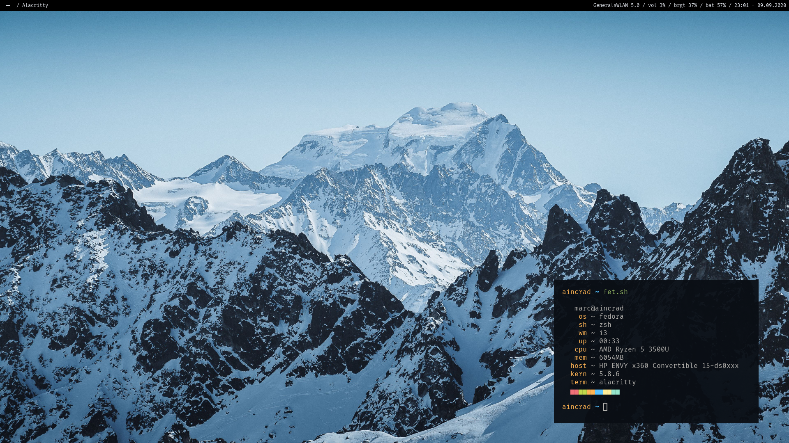

# Marc's Dotfiles

+ Shell: zsh
+ Term: alacritty
+ WM: i3

## Programs
+ Editor: nvim
+ Launcher: dmenu
+ Bar: polybar
+ Notifications: dunst
+ Compositor: [picom](https://github.com/ibhagwan/picom)
+ Image Viewer: feh
+ Info: [fet.sh](https://github.com/6gk/fet.sh)
+ Screenshots: Flameshot

## Dependencies

+ [vim-plug](https://github.com/junegunn/vim-plug)
+ fzf

### Nvim LSP

+ [Python](https://github.com/palantir/python-language-server)
+ [Rust](https://github.com/rust-analyzer/rust-analyzer)
+ [TeX](https://github.com/latex-lsp/texlab)

## Fonts
+ Fira Code Regular Nerd Font Complete Mono.ttf: General
+ IPAGothic.ttf: Japanese Characters
+ [Siji](https://github.com/stark/siji): Icon Font for Polybar

To get a siji icon: `clone, ./install.sh, ./view.sh, echo "\ue002"`

